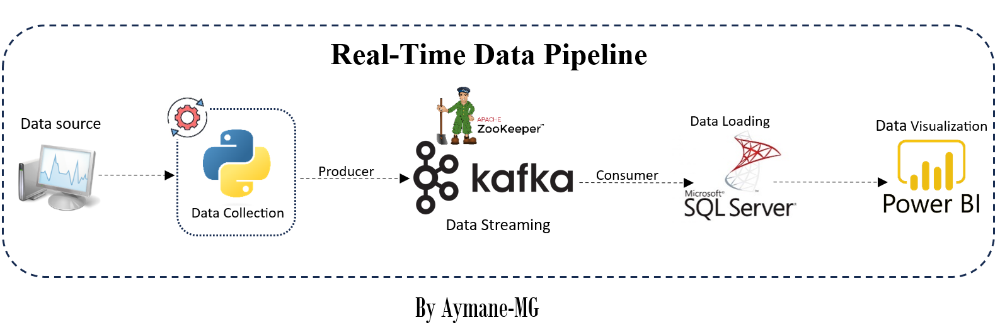
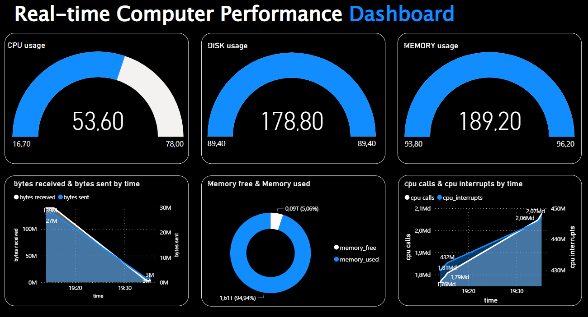

# Real-Time Data Pipeline Using-Kafka

## Table of Contents
1. [Project Overview](#project-overview)
3. [Technologies Used](#technologies-used)
4. [Data Pipeline](#data-pipeline)
5. [Repository Structure](#repository-structure)
6. [How to Run](#how-to-run)
7. [Dashboard](#dashboard)
8. [Acknowledgments](#acknowledgments)
9. [Conclusion](#conclusion)
10. [Contacts](#contacts)

## Project Overview
This project implements a real-time data pipeline using `Apache Kafka`, Python's `psutil` library for metric collection, and `SQL Server` for data storage. The pipeline collects metrics data from the local computer, processes it through Kafka brokers, and loads it into a SQL Server database. Additionally, a real-time dashboard is created using `Power BI`, providing a user-friendly interface for monitoring the collected metrics.

## Technologies Used
- **Python:** Utilized the psutil library for collecting metrics data and Kafka Python client for producing and consuming messages.
- **Apache Kafka:** Implemented a distributed streaming platform to handle real-time data processing and communication between producers and consumers.
- **Apache Zookeeper:** Used for coordinating and managing Kafka brokers.
- **SQL Server:** Stored and managed the collected metrics data in a relational database.
- **Power BI:** Connected to the SQL Server database to visualize real-time metrics and create the dashboard.

# Data Pipeline

Here is the data pipeline :



The data pipeline consists of the following steps:
1. **Data Collection:** Metrics data is collected from the local computer using the psutil Python library.
2. **Data Production:** The collected data is sent as messages to Kafka topics through a Kafka producer.
3. **Data Consumption:** Kafka consumers read the messages from the topics, process them, and load the data into SQL Server.
4. **Dashboard Creation:** Power BI connects to the SQL Server database and creates a real-time dashboard for monitoring the metrics data.

# Repository Structure

```bash 
Real-Time-Data-Pipeline-Using-Kafka:.
|   README.md
|
+---dashboard
|       dashboard_real-time.pbix
|       dashboard_real-time.pdf
|
+---images
|       dashboard.png
|       data_pipeline.png
|
\---Main
        consumer.py
        data_pipeline.py
        Kafka_commands.sh
        producer.py
        requirements.txt
        sql-scripts.sql
```

# How to Run
1. **Setting up Kafka:** Ensure Apache Kafka and Apache Zookeeper are installed and configured properly. Modify Kafka and Zookeeper configurations in the `config/` directory if necessary.

2. **Database Setup:** Create a database and necessary table in 
SQL Server using the script provided in `sql-scripts.sql`.

3. **Start the Apache Zookeeper :**

```bash 
.\bin\windows\zookeeper-server-start.bat .\config\zookeeper.properties
```

4. **Start kafka  server :**

```bash
.\bin\windows\kafka-server-start.bat .\config\server.properties
```

4. **Create  kafka  topic :**

```bash 
.\bin\windows\kafka-topics.bat --create --topic firstTopic --bootstrap-server localhost:9092
```
5. **Start the producer :**

```bash 
.\bin\windows\kafka-console-producer.bat --topic firstTopic --bootstrap-server localhost:9092
```

6. **Start the consumer :**

```bash 
.\bin\windows\kafka-console-consumer.bat --topic firstTopic --from-beginning --bootstrap-server localhost:9092
```
- this commands for  windows OS.

7. **Running the Pipeline:**

    #### 7.1 Install the requirements :

    ```bash 
    pip install requirements.txt
    ```
    #### 7.2 Run `data_pipeline.py` 
    to collect metrics data and send messages to Kafka topics, consume messages from Kafka topics and load data into SQL Server. (change the server name of sql server database)

8. **Dashboard Visualization:** Open `dashboard_real-time.pbix` in Power BI and connect to the SQL Server database to visualize real-time metrics.


# Dashboard
Here is the Dashboard created in Power BI:




# Acknowledgments
- Special thanks to the open-source communities behind `Apache kafka`, `Power BI` and `Python`.

# Conclusion
This project demonstrates an effective implementation of a real-time data pipeline using Apache Kafka, Python, SQL Server, and Power BI. It allows seamless collection, processing, and visualization of system metrics, enabling users to gain valuable insights into system performance.

you can watch the demo video <a href="https://www.youtube.com/watch?v=rVQFABynodw" target="_blank">here</a> 

# Contacts
For any inquiries or further information, please contact:
- **Name:** Aymane Maghouti
- **Email:** aymanemaghouti@gmail.com
- **LinkedIn:** <a href="https://www.linkedin.com/in/aymane-maghouti/" target="_blank">Aymane Maghouti</a><br>
